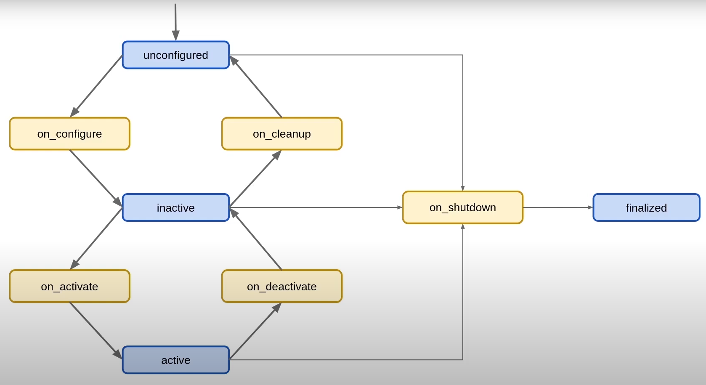
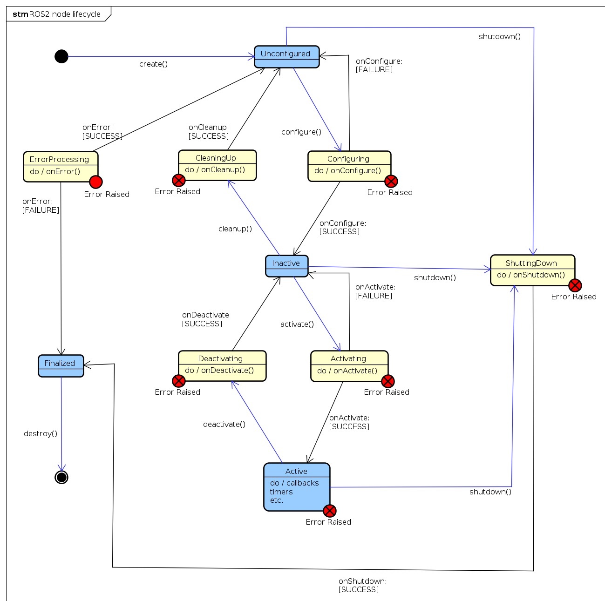

# Lifecycle 
The LifecycleNode organizes the code into primary states (Primary States) and transition phases (Transitional States). This allows the node to follow a standardized lifecycle protocol during its activation within the pipeline, including a proper shutdown procedure in case of runtime issues. 


### Primary State:

- unconfigured
- inactive
- active
- shutdown


### Transitional State:

- configuring
- activating
- deactivating
- cleaningup
- shuttingdown


Below is a simple state diagram illustrating the Lifecycle states and their transitions:




Now, a more detailed diagram:




# Changes in the node:

Within the already existing callbacks, the changes are minimal. The main difference is that, inside the node—after the constructor—three additional functions are added:


### on_configure:

Within this function, the node’s parameters, subscribers and publishers are declared.


### on_activate:

Within this function, the node’s main callback is called.


### on_shutdown

Within this function, the node enters a frozen state, where it no longer executes any logic, requiring the node to be restarted in such cases.


# Debug

To check the current state of a running node:
`ros2 lifecycle get /node_name`

To set a new state for the node:

`ros2 lifecycle set /node_name <state_number / state_name>`

If it is not possible to transition to the desired state from the current state, a corresponding warning is returned.


# Commands for compiling packages 

### For compiling both, use: 
```bash
    colcon build 
   ```

### For compiling individualy, use: 
```bash
    colcon build --packages-select ros2_mapper
   ```


## Running & Launching

### Mapper launchs: 

```bash
    ros2 run ros2_mapper mapper_lifecycle.py
   ```

```bash
    ros2 launch ros2_mapper mapper_lifecycle.launch.py
   ```
## Simulation Track Test Node
### sim_track_node

For controlled testing and debugging of the mapping pipeline, this package provides a dedicated ROS 2 node named `sim_track_node`. This node subscribes to the complete ground-truth track provided by the FSDS simulator and generates a synthetic partial track corresponding to the vehicle’s current camera field of view.

The generated partial track is published as a simulated perception input, enabling evaluation of the clustering and mapping algorithms under deterministic and repeatable conditions.

### Purpose and Features

The `sim_track_node` is primarily intended to isolate and diagnose mapping issues that originate from:

Cone detection uncertainties

Incorrect frame transformations

Inconsistent sensor timestamps

By bypassing real perception pipelines, the node allows focused testing of the clustering and mapping logic alone.

### Functionalities

- Subscribes to the full FSDS track ground truth

- Extracts cones within a configurable camera visibility range

- Publishes a synthetic TrackStampedWithCovariance message

- Optionally injects Gaussian positional noise into cone locations

- Enables robustness testing of clustering and track reconstruction algorithms

### Gaussian Noise Injection

To evaluate algorithm resilience against perception errors, the node can apply zero-mean Gaussian noise to cone positions.


#### Typical Use Cases

- Debugging clustering behavior without perception noise

- Validating coordinate frame transformations

- Stress-testing mapping under increasing uncertainty

- Regression testing after algorithm modifications
